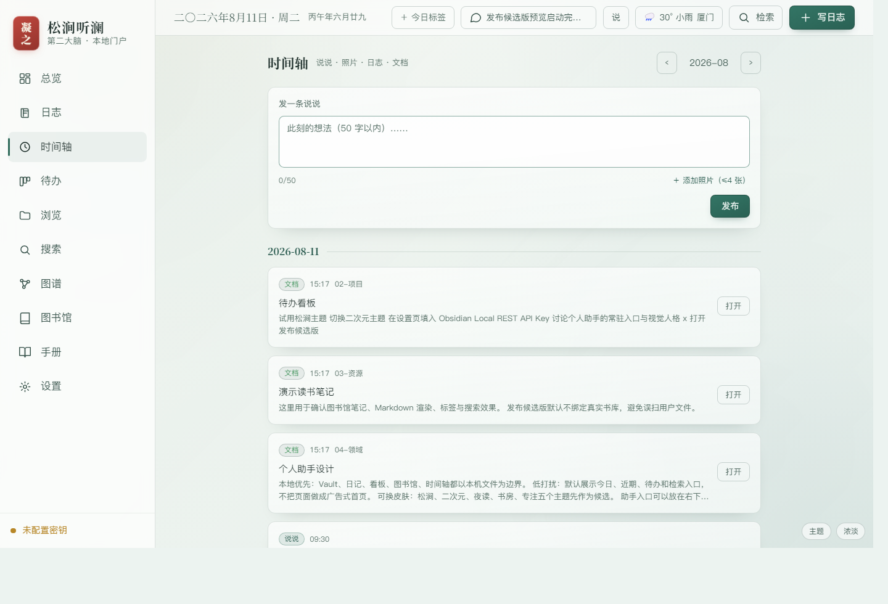
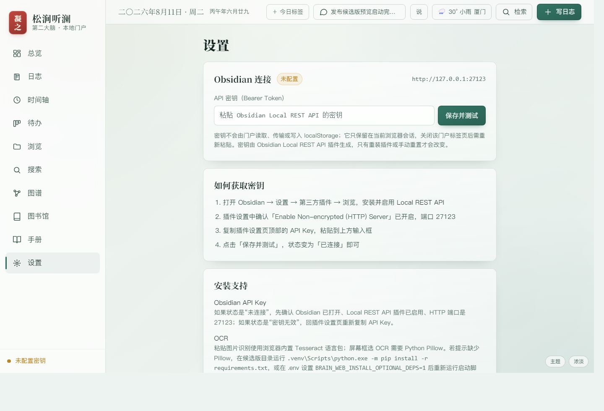
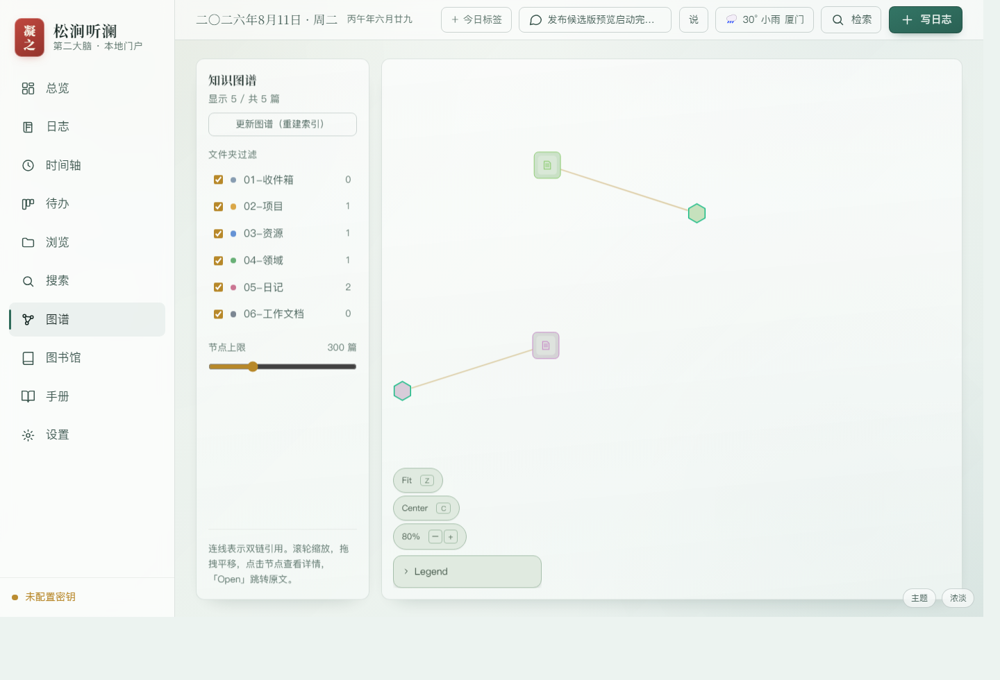

# 松涧听澜

> 一个写给自己的本地知识门户：把日记、动态、待办、图书馆、搜索和知识图谱汇聚在本机，不上传，不迎合算法，只记录你真正想记录的东西。

松涧听澜不是又一个云笔记，也不是面向外部观众的社交产品。它更像一个人的个人社交网站：说说写给自己看，日志写给未来的自己看，图书馆和知识图谱服务自己的长期思考。所有核心数据都落在本地 Obsidian Vault 和本机运行缓存里，门户只负责把这些分散的数据汇聚成一个可浏览、可检索、可回顾的个人空间。

[打开网页预览](docs/index.html) · [操作手册](docs/操作手册.md) · [系统架构](docs/系统架构.md) · [发布前审阅清单](docs/发布前审阅清单.md)



## 它解决什么问题

很多个人知识系统最后会卡在三个地方。

第一，记录分散。日记在一个目录，读书笔记在另一个目录，待办藏在 Markdown 看板里，照片和短想法又散落在别处。松涧听澜把这些本地数据汇聚到同一个门户里，让你不用在文件夹、Obsidian 页面和搜索窗口之间来回切换。

第二，记录容易被平台化。很多“动态”和“日志”工具默认面向上传、展示、同步和互动，但很多内容其实只是写给自己看的。松涧听澜把“说说”“照片”“日志摘录”“文档改动”做成一条只属于自己的时间轴，像个人社交网站，但观众只有你自己。

第三，知识库有内容却难以回顾。文件越多，越需要索引、图谱、标签、全文搜索和图书馆视图。松涧听澜用本地索引把 Vault 变成可回看的生活与知识地图，而不是一堆越积越深的 Markdown 文件。

## 核心原则

- 本地优先：Vault、日记、看板、图书馆、时间轴和缓存默认都在本机。
- 不上传日志：日记、说说、照片、读书笔记不需要进入云端服务。
- 写给自己看：界面围绕回顾、检索、整理，而不是点赞、推荐和曝光。
- 可迁移：核心内容仍是 Markdown 和本地文件，不被门户锁死。
- 可审查：发布候选版剥离真实 Vault、凭证、日志、缓存和运行态目录。

## 页面效果

### 时间轴：一个人的动态流

时间轴把短想法、照片、日志摘录和文档改动放在同一条月度流里。它不是公开社交，而是给自己保留“当时我在想什么、做什么、读什么”的线索。


### 设置：安装支持不再藏在文档深处

Obsidian API Key、Local REST API 插件、OCR 依赖和 Pillow 安装提示都放在设置页。用户第一次打开候选版时，可以直接看到下一步该装什么、填什么。



### 图谱：把本地笔记变成可回看的知识地图

图谱从本地 Vault 缓存生成，展示笔记之间的双链关系、文件夹分布和节点过滤。它服务的是个人理解和回顾，不依赖远端数据库。



## 功能概览

| 模块 | 作用 | 数据边界 |
|---|---|---|
| 总览 | 今日入口、近期状态、安装支持提示、主题切换 | 本机门户 |
| 日志 | 按日期读写 Markdown 日记 | Obsidian Vault |
| 时间轴 | 说说、照片、日志摘录、文档改动 | Vault + 本地缓存 |
| 待办 | Markdown 看板、拖拽、并发保护 | Obsidian Vault |
| 浏览 | 按目录浏览 Markdown 文件 | Obsidian Local REST API |
| 搜索 | 文件名、正文、标签搜索 | 本地索引 + Obsidian |
| 图谱 | 双链关系、节点过滤、图形浏览 | `www/cache` 可重建缓存 |
| 图书馆 | 电子书预览、分类、读书笔记、OCR | Vault + 本机门户 |
| 设置 | API Key 粘贴、连接测试、安装提示 | 浏览器会话 |

## 主题

内置 5 套主题，可在右下角切换：

- 松涧：水墨纸感，默认主题。
- 二次元：粉蓝赛璐璐风格。
- 夜读：深色高对比，适合夜间浏览。
- 书房：暖纸藏书感。
- 专注：极简低扰，适合长期工作。

主题偏好只保存在浏览器本机 `localStorage`，不会写入仓库或 Vault。

## 一键预览

最短路径：

```text
1. 安装 Python 3.11+
2. 双击 启动门户.bat
3. 浏览器打开 http://127.0.0.1:8765/
```

本仓库采用“开箱预览”发布形态，已提交 `www/index.html`、前端资源和 OCR 语言数据；克隆后不需要先运行 npm 构建即可进入启动流程。首次启动仍需要本机有 Python 3.11+，Obsidian Vault 路径通过 `.env` 配置。

首次启动会自动完成：

- 创建 `.venv`。
- 读取 `.env` 中的本机配置。
- 未配置真实 Vault 时创建 `demo_vault`。
- 如缺少前端构建产物，则尝试用 Node.js/npm 构建。
- 从 8765 开始寻找可用本机端口，最多尝试到 8776。

停止门户：

- 默认端口 8765 可双击 `停止门户.bat`。
- 如果启动脚本自动换到 8766 或更高端口，请按启动输出的端口停止对应进程；发布前建议固定端口或补强停止脚本。

## 真实 Vault 配置

复制 `.env.example` 为 `.env`，填写仓库外的 Obsidian Vault 路径：

```ini
BRAIN_WEB_VAULT=C:\path\to\your\ObsidianVault
BRAIN_WEB_PORTAL_PORT=8765
```

推荐 Vault 一级目录：

```text
01-收件箱
02-项目
03-资源
04-领域
05-日记
```

默认约定：

```text
03-资源\电子图书馆      图书馆扫描目录
03-资源\读书笔记        读书笔记写入目录
05-日记\说说            个人动态写入目录
05-日记\说说\images     说说配图目录
```

`.env` 是本机私有配置，不能提交到 Git。

## Obsidian API Key 支持

需要编辑、全文检索和 Obsidian 写入能力时，安装 Obsidian 的 **Local REST API** 插件。

步骤：

1. 打开 Obsidian。
2. 进入“设置 → 第三方插件”。
3. 安装并启用 `Local REST API`。
4. 确认 HTTP 地址为 `http://127.0.0.1:27123`。
5. 复制插件生成的 API Key。
6. 在门户“设置”页粘贴 API Key 并测试连接。

API Key 只保存在当前浏览器标签页的 `sessionStorage`。它不会写入 `.env`，不会进入仓库，也不会由门户服务端持久化。关闭标签页后通常需要重新粘贴。

命令行验证可以使用仓库外密钥文件：

```powershell
python scripts\verify_rest_api.py --key-file C:\path\outside\repo\obsidian_key.txt
```

该脚本会创建临时测试笔记，并尝试恢复测试过程中的看板改动。运行前请备份 Vault，不要在多人或多设备同时编辑同一看板时运行。

## OCR 支持

OCR 分两种：

- 粘贴图片 OCR：在图书馆读书笔记区域直接 `Ctrl+V` 粘贴截图或图片，使用浏览器端 Tesseract 和随包提供的中英文语言数据。
- 屏幕框选 OCR：点击“屏幕框选 OCR”，门户服务端截取屏幕，再由浏览器端识别。该能力需要 Python Pillow。

安装 Pillow：

```powershell
.venv\Scripts\python.exe -m pip install -r requirements.txt
```

或在 `.env` 中开启：

```ini
BRAIN_WEB_INSTALL_OPTIONAL_DEPS=1
```

然后重新运行 `启动门户.bat`。

## 门户口令

发布候选版默认不启用门户访问口令，便于本机一键预览。

需要启用时，在 `.env` 中设置：

```ini
BRAIN_WEB_PORTAL_AUTH=1
BRAIN_WEB_PORTAL_TOKEN=至少16位随机口令
```

这只保护本机门户会话，不是公网部署方案。本项目不建议通过端口映射、反向代理或内网穿透暴露门户。

## 目录结构

```text
.
├─ frontend/                  React + Vite 前端源码
│  ├─ public/                 手册、OCR 语言数据等静态资源
│  └─ src/                    页面、组件、主题、客户端 API
├─ scripts/                   演示 Vault、图谱索引、REST 验证脚本
├─ tests/                     单元测试与发布卫生检查
├─ tools/memory-graph/        内置图谱组件源码
├─ docs/                      文档、网页预览和截图资产
├─ www/                       已构建前端预览产物，发布包可包含
├─ serve_portal.pyw           本机门户服务和图书馆 API
├─ 启动门户.bat               Windows 一键启动脚本
├─ 停止门户.bat               Windows 停止脚本
├─ .env.example               本机配置模板
├─ requirements.txt           可选 Python 依赖
├─ RELEASE_MANIFEST.md        发布候选包边界清单
├─ THIRD_PARTY_NOTICES.md     第三方组件说明
└─ LICENSE                    当前许可证文件
```

运行时生成但不应提交：

```text
.venv/
state/
demo_vault/
www/cache/
frontend/node_modules/
tools/**/node_modules/
*.log
.env
.env.*
```

## 构建与测试

```powershell
cd frontend
npm ci
npm run build
```

```powershell
cd ..
node tests\test_lib.mjs
py -3 tests\test_release_hygiene.py
```

手工刷新本地索引：

```powershell
python scripts\build_index.py
```

直接运行后端服务时必须提供有效 `BRAIN_WEB_VAULT`。需要自动创建演示 Vault 时，请使用 `启动门户.bat`。

## 已知限制

- 当前主要适配 Windows 本机。
- Obsidian 写入与全文检索依赖 Local REST API 插件。
- 屏幕框选 OCR 需要 Pillow；粘贴图片 OCR 不需要 Pillow。
- 本项目不是云同步服务，不处理多设备状态合并。
- 图谱和统计缓存可重建，不应作为权威数据源。
- 发布候选版默认关闭门户口令；需要时必须在 `.env` 中显式开启。

## 文档入口

- [网页预览](docs/index.html)
- [操作手册](docs/操作手册.md)
- [系统架构](docs/系统架构.md)
- [本地优先与运行时配置 ADR](docs/decisions/ADR-001-local-first-and-runtime-configuration.md)
- [第三方组件说明](THIRD_PARTY_NOTICES.md)

## 许可证与第三方组件

当前候选包带有 `LICENSE` 文件。正式公开前请确认许可证文本、项目可见性和第三方组件再分发要求。

第三方组件说明见 [THIRD_PARTY_NOTICES.md](THIRD_PARTY_NOTICES.md)。
