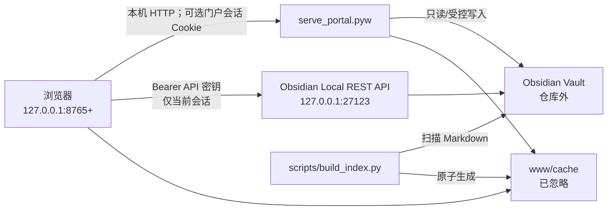

# 系统架构

## 组件关系

## 边界

| 边界 | 设计 | 不应做的事 |
|---|---|---|
| 浏览器 → 门户 | 发布候选版默认无口令便于本机预览；可通过 `BRAIN_WEB_PORTAL_AUTH=1` 启用口令 Cookie；只监听回环。 | 暴露到公网、保存口令到浏览器持久存储。 |
| 浏览器 → Obsidian API | 用户在当前标签页粘贴 API 密钥。 | 由门户下发密钥、写入 localStorage、提交密钥文件。 |
| 门户 → Vault | 通过 `BRAIN_WEB_VAULT` 指向仓库外目录。 | 在仓库内创建或复制真实 Vault。 |
| 构建 → `www/` | Vite 输出与索引缓存均可再生。 | 提交构建产物或图谱缓存。 |

## 运行时目录

| 目录 | 生成者 | 可否删除 | Git |
|---|---|---|---|
| `www/` | Vite 与索引脚本 | 可重新构建 | 忽略 |
| `state/` | 门户与索引 | 可删除后重建状态；先保留日志用于诊断 | 忽略 |
| `.venv/`、`frontend/node_modules/` | 依赖安装 | 可重新安装 | 忽略 |

## 关键流程

### 启动与授权

1. `启动门户.bat` 读取本机 `.env`；无有效 `BRAIN_WEB_VAULT` 时创建候选版 `demo_vault`。
2. 首次运行自动创建 `.venv` 并安装 Python 依赖；如无构建产物，执行前端构建。
3. 启动脚本选择可用端口，随后启动门户进程并打开浏览器。
4. 若显式启用 `BRAIN_WEB_PORTAL_AUTH=1`，浏览器用本次口令交换 8 小时受限会话 Cookie。
5. 用户单独提供 Obsidian API 密钥；门户不会读取该密钥。

### 索引

`build_index.py` 只扫描五个 PARA 分区下的 Markdown，提取标题、标签、摘要和双链，采用临时文件加替换方式写入缓存。它不修改 Vault 内容。

## 扩展原则

- 新接口默认本机回环、默认最小权限、默认不读凭证。
- 新运行状态放在被忽略目录；新样例使用占位值。
- 改动 Vault 的脚本需要提供预演模式、明确目标和可恢复路径。
- 引入第三方源码时保留许可证，说明来源和修改点；能用依赖声明就不要复制大型仓库。
